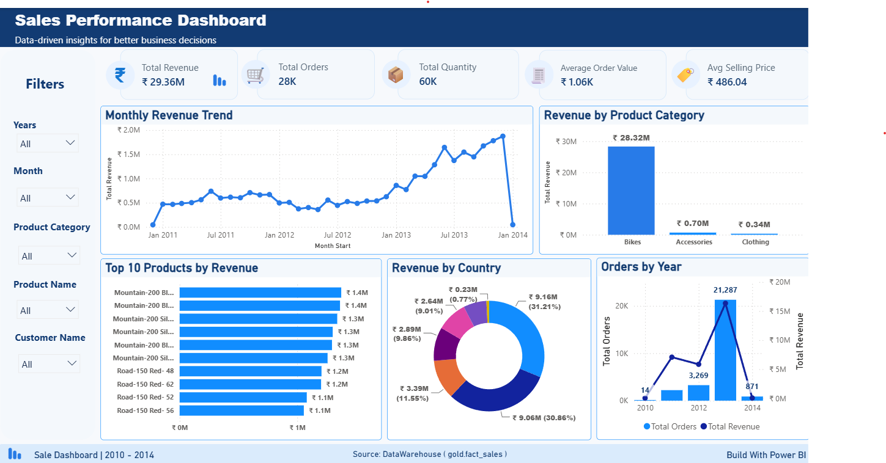
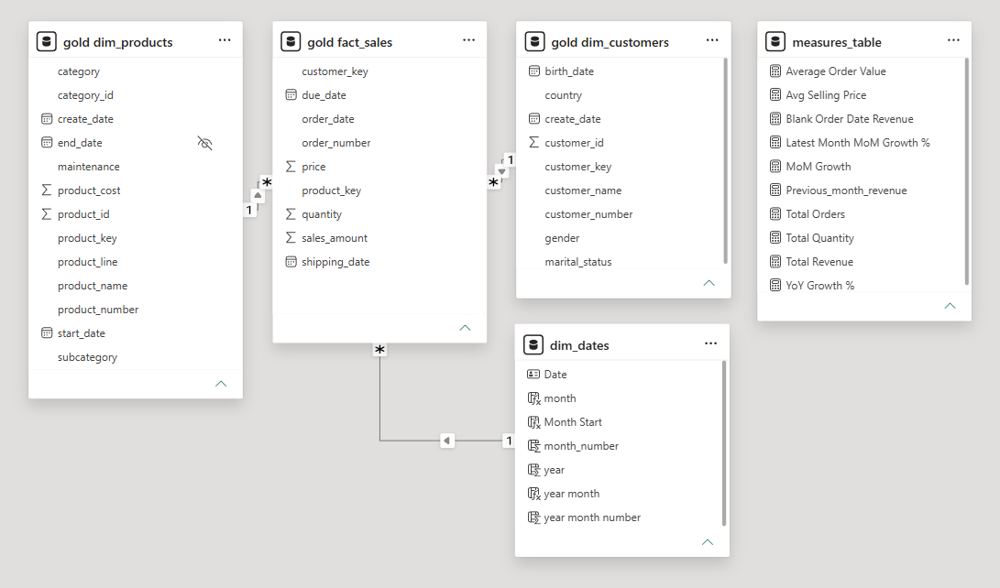
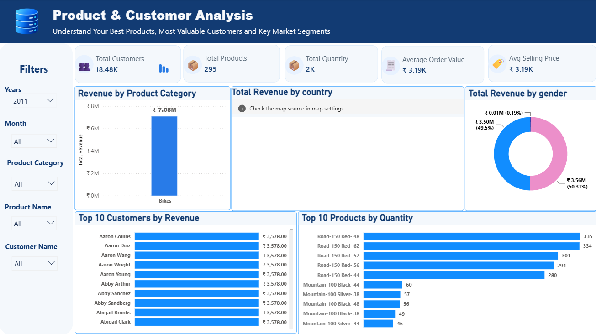
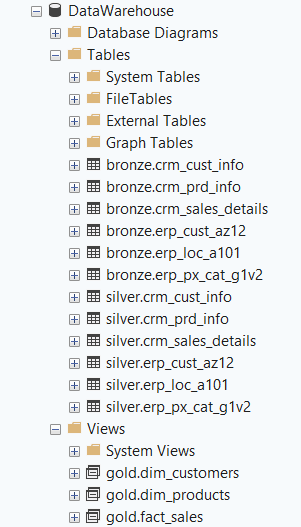

# SQL Data Warehouse & Analytics

> **From raw CRM and ERP data to a trusted SQL Server warehouse, business KPIs, and interactive Power BI insights.**

<p align="center">
  
</p>

<p align="center">
  <strong>SQL Server</strong> · <strong>Data Warehousing</strong> · <strong>SQL Analytics</strong> · <strong>Power BI</strong> · <strong>DAX</strong>
</p>

## Overview

This portfolio project demonstrates a complete analytics workflow using CRM and ERP data. The data is loaded into a layered SQL Server warehouse, cleaned and validated, modeled for analysis, queried with SQL, and presented through an independently designed Power BI report.

The project is built around a simple goal: **turn fragmented operational data into reliable information that supports better business decisions.**

## Business Problem

Data from different operational systems can contain missing values, inconsistent identifiers, invalid dates, and different formats. These issues make reporting slower and reduce confidence in business results.

This project addresses the problem by separating data ingestion, transformation, modeling, analysis, and reporting into clear stages.

## End-to-End Workflow

```text
CRM + ERP Source Data
          ↓
Bronze — Raw Data Ingestion
          ↓
Silver — Cleaning and Validation
          ↓
Gold — Business-Ready Data Model
          ↓
SQL Analytics and KPI Logic
          ↓
Power BI Reporting
          ↓
Business Insights
```

## Solution Architecture

| Layer | Purpose |
|---|---|
| **Bronze** | Preserves CRM and ERP data in its original form. |
| **Silver** | Cleans, standardizes, validates, and prepares data for analysis. |
| **Gold** | Provides reusable fact and dimension objects for reporting. |
| **Analytics** | Answers sales, customer, product, and time-based business questions. |
| **Power BI** | Converts the analytical model into interactive dashboards and KPIs. |

The Gold layer follows a star-schema design centered on:

```text
                 dim_customers
                       │
                       │
       dim_products ─ fact_sales
```



## Power BI Dashboard

The Power BI reporting layer was created independently for this portfolio project. I designed the report pages, KPI cards, DAX measures, filters, chart selection, layout, and visual storytelling.

### Dashboard Pages

<table>
  <tr>
    <td align="center" width="50%">
      <strong>Sales Performance</strong><br><br>
      
    </td>
    <td align="center" width="50%">
      <strong>Products & Customers Analysis</strong><br><br>
      
    </td>
  </tr>
</table>

### Page 1 — Sales Performance

The first page provides an executive view of revenue and sales activity through monthly trends, revenue by product category, top products, revenue by country, yearly orders, and interactive filters.

| KPI | Dashboard value |
|---|---:|
| **Total Revenue** | ₹29.36M |
| **Total Orders** | 28K |
| **Total Quantity** | 60K |
| **Average Order Value** | ₹1.06K |
| **Average Selling Price** | ₹486.04 |

### Page 2 — Products & Customers Analysis

The second page focuses on product performance, customer value, market distribution, and customer demographics.

| KPI | Dashboard value |
|---|---:|
| **Total Customers** | 18.48K |
| **Total Products** | 295 |
| **Total Quantity** | 60K |
| **Average Order Value** | ₹1.06K |
| **Average Selling Price** | ₹486.04 |

The page includes revenue by product category, revenue by country, revenue by gender, Top 10 Customers by Revenue, and Top 10 Products by Quantity.

## Technical Skills Demonstrated

This project demonstrates practical experience with **SQL Server data warehousing, Bronze–Silver–Gold architecture, CRM and ERP integration, data quality validation, dimensional modeling, star schemas, SQL analytics, DAX measures, KPI development, Power BI reporting, and technical documentation**.

## Repository Structure

```text
SQL-Data-Warehouse-Analytics/
├── 01_datasets/          # CRM and ERP reference datasets
├── 02_scripts/           # Bronze, Silver, and Gold SQL scripts
├── 03_analytics/         # Business-focused SQL analysis
├── 04_powerbi/           # Power BI report and model files
├── 05_docs/              # Architecture and data-model documentation
├── 06_screenshots/       # Dashboard and technical previews
├── .gitignore
└── README.md
```

## Explore the Repository

| Area | Description | Link |
|---|---|---|
| **Warehouse scripts** | SQL implementation for the Bronze, Silver, and Gold layers | [`02_scripts/`](02_scripts/) |
| **SQL analytics** | Business questions, KPIs, rankings, and trend analysis | [`03_analytics/`](03_analytics/) |
| **Power BI** | Report and model assets | [`04_powerbi/`](04_powerbi/) |
| **Architecture** | Warehouse design and data-flow documentation | [`05_docs/architecture/`](05_docs/architecture/) |
| **Data model** | Star-schema and modeling documentation | [`05_docs/data_model/`](05_docs/data_model/) |
| **Screenshots** | Dashboard, model, and SQL Server previews | [`06_screenshots/`](06_screenshots/) |



## Reference and Attribution

The data-engineering workflow was developed by following the learning path and implementation reference from [Data with Baraa][1]. This includes the Bronze–Silver–Gold approach, the general SQL Server pipeline structure, and the reference CRM/ERP datasets.

The **Power BI reporting layer was created independently** for this portfolio project. The dashboard pages, KPI definitions, DAX measures, filters, visual layout, and business-insight presentation are my own work.

> **Reference for data engineering and datasets:** [Data Warehouse and Analytics Project — Data with Baraa][1]

> **Original work in this repository:** Power BI dashboard design, KPI reporting, DAX measures, visual storytelling, documentation, and presentation of business insights.

## Final Outcome

> **Raw data → reliable warehouse → reusable KPIs → interactive business insights**

This project demonstrates how a structured data-engineering workflow can support clear, practical, and decision-ready business intelligence.

---

<p align="center">
  <strong>Built to turn data into understanding.</strong>
</p>

## References

[1]: https://github.com/DataWithBaraa/sql-data-warehouse-project "Data Warehouse and Analytics Project — Data with Baraa"

[1] [Data Warehouse and Analytics Project — Data with Baraa][1]
